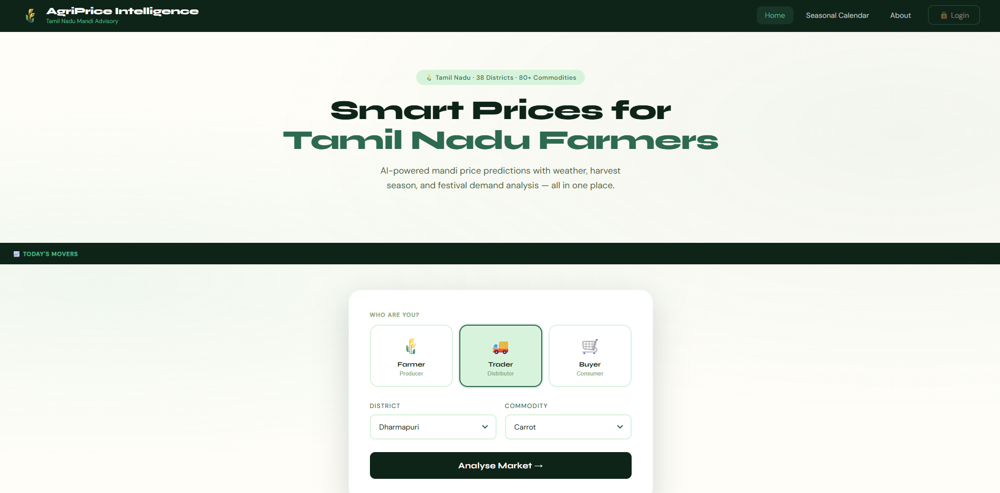
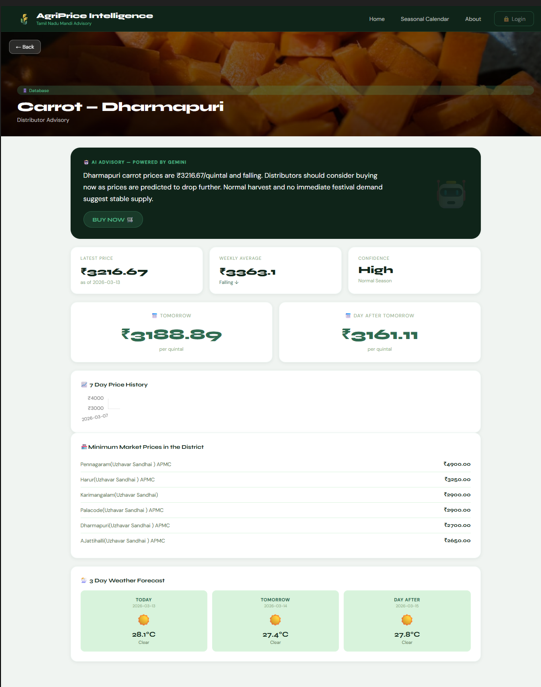
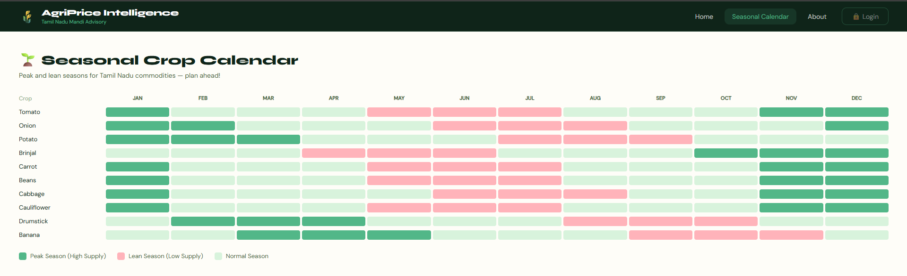

<div align="center">
<h1>🌾 AgriPrice Intelligence</h1>
<h3>Tamil Nadu Mandi Price & AI Advisory Dashboard</h3>

<br/>


<br/><br/>

<a href="https://agriprice-intelligence-1.onrender.com" target="_blank">
  🌐 **Live Demo Here**
</a>

⚠️ **First Load Delay**  
  The app may take **20–30 seconds** to load initially due to Render free-tier cold start.  
  Subsequent requests are fast ⚡.


<br/><br/>


<br/><br/>


> 🚜 **Empowering Tamil Nadu's farming ecosystem** with real-time mandi prices, AI-driven advisories, weather insights, and harvest intelligence — all in one place.

<br/>

[🔍 Features](#-features) • [🗂️ Project Structure](#-project-structure) • [⚙️ Setup Guide](#-setup-guide) • [🗄️ Database](#-database-setup) • [🚀 Run Locally](#-running-the-app) • [📊 How It Works](#-how-it-works) • [🛣️ Roadmap](#-Feature-Goal)

</div>

---

## 🧭 What is AgriPrice Intelligence?

AgriPrice Intelligence is a **full-stack agricultural price intelligence platform** designed specifically for **Tamil Nadu's mandi ecosystem**. It helps three types of users make smarter decisions:

| 👤 User Type | 🎯 What They Get |
|---|---|
| 🧑‍🌾 **Farmer (Producer)** | Should I sell now or wait? Get HOLD / SELL signals with reasoning |
| 🏪 **Trader (Distributor)** | Know the best time and market to buy or move stock |
| 🛒 **Consumer (Buyer)** | Understand if today's market price is fair or inflated |

It combines **real mandi data**, **live weather**, **harvest seasons**, **festival impact**, and **Google Gemini AI** to produce plain-English guidance — not just raw numbers.

---

## ✨ Features

### 📍 Smart District & Commodity Selection
- Covers all **38 Tamil Nadu districts**
- **80+ commodities** sourced from [Agmarknet](https://agmarknet.gov.in)
- Clean dropdown UX — no overwhelming data grids

### 📈 Price Intelligence Engine
- **7-day sliding window** price history stored in PostgreSQL
- **Trend detection**: Rising 📈 / Falling 📉 / Stable ➡️ with confidence score
- **Price predictions** for tomorrow and the day after
- **Harvest season** and **festival calendar** blended into the signal

### 🤖 AI Advisory (Google Gemini)
- 3–4 line, plain-English advisory in every result
- Merges price signals + weather + harvest + festival context
- **Web-search fallback** when the database has no data for a given district-commodity pair

### 🌦️ Live Weather Integration
- **3-day weather forecast** via OpenWeather API
- Weather factors (rain, heat, humidity) influence the advisory

### 💻 Modern Single-Page UI
- Home, Seasonal Calendar, and About sections
- Live **"Market Movers" ticker** showing daily price changes
- **Chart.js** price charts for 7-day history visualization
- Fully responsive — works on mobile and desktop

---

## 🗂️ Project Structure

```
AgriPrice_Intelligence/
│
├── backend/
│   ├── app.py              ← Flask API entrypoint (all routes)
│   ├── predict.py          ← PostgreSQL price analysis & BUY/SELL/HOLD signals
│   ├── AI_advisory.py      ← Google Gemini prompts & web-search fallback
│   ├── fetch_prices.py     ← Agmarknet → PostgreSQL data ingestion
│   └── config.py           ← API keys, DB config, static harvest/festival data
│
├── frontend/
│   ├── index.html          ← Single-page app shell
│   ├── css/
│   │   └── style.css       ← Modern UI styling
│   └── js/
│       ├── api.js          ← Fetch wrappers to backend + Unsplash
│       ├── app.js          ← Main app logic and user interactions
│       └── ui.js           ← Rendering helpers and Chart.js integration
│
├── docs/                   ← Screenshots for README
├── .env.example            ← Template for environment variables (safe to commit)
├── .gitignore              ← Excludes .env and sensitive files
└── requirements.txt        ← Python backend dependencies
```

---

## ⚙️ Setup Guide

> **Step-by-step** — follow each section in order.

### ✅ Prerequisites

Make sure you have the following installed and ready:

| Requirement | Version | Notes |
|---|---|---|
| Python | 3.10+ | Tested on 3.13 |
| PostgreSQL | Any recent | Must be running locally or remotely |
| Agmarknet API Key | — | From [data.gov.in](https://data.gov.in) |
| OpenWeather API Key | — | From [openweathermap.org](https://openweathermap.org) |
| Google Gemini API Key | — | From [Google AI Studio](https://aistudio.google.com) |
| Unsplash Access Key | — | For commodity images in the UI |

---

### Step 1 — Clone the Repository

```bash
git clone https://github.com/<your-username>/AgriPrice_Intelligence.git
cd AgriPrice_Intelligence
```

---

### Step 2 — Create a Virtual Environment

```bash
# Create the virtual environment
python -m venv .venv

# Activate it — Windows
.venv\Scripts\activate

# Activate it — Linux / macOS
source .venv/bin/activate
```

---

### Step 3 — Install Dependencies

```bash
pip install -r requirements.txt
```

---

### Step 4 — Configure Environment Variables

Create a `.env` file in the **project root** (copy from `.env.example`):

```env
# ── API Keys ─────────────────────────────────
AGMARKNET_API_KEY=your_agmarknet_key_here
OPENWEATHER_API_KEY=your_openweather_key_here
GEMINI_API_KEY=your_gemini_key_here
UNSPLASH_ACCESS_KEY=your_unsplash_key_here

# ── PostgreSQL Database ───────────────────────
PG_HOST=localhost
PG_PORT=5432
PG_USER=postgres
PG_PASSWORD=your_password_here
PG_DATABASE=commodity_intelligence
```

> ⚠️ **Security Rule:** Never commit your `.env` file. It is already listed in `.gitignore`. Only commit `.env.example` with placeholder values.

---

## 🗄️ Database Setup

This project uses **PostgreSQL** as its database.

### Create the Database

Connect to PostgreSQL and run:

```sql
CREATE DATABASE commodity_intelligence;
```

### Tables Overview

The backend uses two main tables:

#### `mandi_prices` — Core price records from Agmarknet

```sql
CREATE TABLE mandi_prices (
    id              SERIAL PRIMARY KEY,
    arrival_date    DATE NOT NULL,
    district        VARCHAR(100) NOT NULL,
    commodity       VARCHAR(100) NOT NULL,
    market          VARCHAR(150),
    min_price       NUMERIC(10, 2),
    max_price       NUMERIC(10, 2),
    modal_price     NUMERIC(10, 2),
    created_at      TIMESTAMP DEFAULT NOW()
);
```

#### `commodity_prices` — Market-level averages

```sql
CREATE TABLE commodity_prices (
    id              SERIAL PRIMARY KEY,
    recorded_date   DATE NOT NULL,
    district        VARCHAR(100) NOT NULL,
    commodity       VARCHAR(100) NOT NULL,
    market          VARCHAR(150),
    avg_price       NUMERIC(10, 2),
    created_at      TIMESTAMP DEFAULT NOW()
);
```

### Recommended Indexes (for query performance)

```sql
CREATE INDEX idx_mandi_district_commodity ON mandi_prices (district, commodity);
CREATE INDEX idx_mandi_arrival_date ON mandi_prices (arrival_date DESC);
CREATE INDEX idx_commodity_district ON commodity_prices (district, commodity);
```

### Populate the Database

Run the ingestion script to pull fresh data from Agmarknet:

```bash
python backend/fetch_prices.py
```

> 💡 **Tip:** Schedule this script to run daily using a cron job or Windows Task Scheduler to keep prices up to date.

---

## 🚀 Running the App

### Start the Backend (Flask API)

From the project root with your virtual environment activated:

```bash
python backend/app.py
```

The backend starts at: **`http://127.0.0.1:5000`**

#### Available API Endpoints

| Method | Endpoint | Description |
|---|---|---|
| `GET` | `/` | Health check — returns `{ status: "running" }` |
| `GET` | `/districts` | List of all 38 Tamil Nadu districts |
| `GET` | `/commodities?district=<name>` | Commodities available for a district |
| `POST` | `/analyse` | Main analysis — returns price signals + AI advisory |
| `GET` | `/movers` | Daily price movers for the ticker |
| `GET` | `/seasonal` | Harvest and seasonal calendar data |

---

### Start the Frontend

**Option A — Open directly (quickest)**

1. Make sure the backend is running on `http://127.0.0.1:5000`
2. Double-click `frontend/index.html` or open it via `File → Open` in your browser

**Option B — Use a local static server (recommended)**

This avoids CORS and `file://` protocol issues:

```bash
cd frontend
python -m http.server 8000
```

Then open: **`http://127.0.0.1:8000/index.html`**

---

## 📊 How It Works

Here's the full flow from user click to AI advisory:

```
User selects:  User Type  +  District  +  Commodity
                               │
                        POST /analyse
                               │
               ┌───────────────┴────────────────┐
               │                                │
          predict.py                     AI_advisory.py
               │                                │
    ┌──────────▼──────────┐        ┌────────────▼────────────┐
    │ Read last 7–14 days │        │ Fetch 3-day weather      │
    │ from PostgreSQL     │        │ from OpenWeather API     │
    │                     │        │                          │
    │ Compute:            │        │ Build Gemini prompt with:│
    │ • Weekly average    │        │ • Price signals          │
    │ • Trend detection   │        │ • Weather data           │
    │ • Predictions       │        │ • Harvest season         │
    │ • Harvest impact    │        │ • Upcoming festivals     │
    │ • Festival impact   │        │                          │
    │ • BUY/SELL/HOLD     │        │ → Generate AI advisory   │
    └──────────┬──────────┘        └────────────┬────────────┘
               │                                │
               └───────────────┬────────────────┘
                               │
                        Frontend renders:
                     ✅ Advisory + Signal badge
                     📊 7-day price chart
                     🌦️  3-day weather forecast
                     🗓️  Upcoming festival impacts
                     🏪 Active market listings
```

> If **no database data** is found for the selected district-commodity pair, the system automatically falls back to **Gemini web search** to estimate price and trend.

---

## 📸 Screenshots

| Home — Selection Screen | Analysis — Advisory & Chart |
|---|---|
|  |  |

| Seasonal Calendar |
|---|
|  |

> Add screenshots to the `docs/` folder and they will render here automatically.

---

# 🚢 Full-Stack AI Advisory System

  A cloud-deployed full-stack application integrating **Flask**, **NeonDB (PostgreSQL)**, and **Google Gemini API** for real-time AI-powered advisory services.

  ---

  ## 🧠 Overview
  - Backend + Frontend hosted on **Render**
  - Database hosted on **NeonDB (Serverless PostgreSQL)**
  - AI Layer powered by **Google Gemini API**
  - Data Sources: **Agmarknet + OpenWeather**
  ---

  ## 🏗️ Architecture
  User Browser
  ↓
  Render (Flask Backend + Frontend UI)
  ↓
  NeonDB (Serverless PostgreSQL)

  Code

  ---

  ## 🔹 Tech Stack
  - 🌐 Backend: Flask (Python) deployed on Render  
  - 🎨 Frontend: Static SPA served via Flask  
  - 🗄️ Database: NeonDB (PostgreSQL Cloud)  
  - 🤖 AI Layer: Google Gemini API  
  - 📡 Data Source: Agmarknet + OpenWeather  

  ---

  ## ⚙️ Deployment Workflow

  ### 1️⃣ Render Deployment
  - Push code to GitHub  
  - Create Web Service in Render  
  - Connect repo  

  Deploy 🚀

  ### 2️⃣ NeonDB Setup
  Create PostgreSQL project in Neon

  Copy connection string

  Replace local DB config:

  python
  SQLALCHEMY_DATABASE_URI = "your_neon_connection_url"
  Install driver:

  bash
  pip install psycopg2-binary
  ### 3️⃣ Integration
  ✔ Render ↔ NeonDB connected
  ✔ API working in production
  ✔ AI advisory functional
  ✔ Real-time data flow enabled

  📌 Production Notes
  Uses free-tier cloud services

  Cold start delay on first request

  Designed for demo, academic, and scalable prototype use

----

## 🛣️ Feature-Goal

- [ ] 🔐 User authentication and saved watchlists
- [ ] 🌐 Multilingual UI (Tamil, Hindi, English)
- [ ] 📅 Extended harvest calendar and festival dataset
- [ ] 🗺️ Support for additional Indian states
- [ ] 🤖 Automated tests for prediction logic and advisory generation
- [ ] 📱 Progressive Web App (PWA) support for mobile use

---

## 📄 License

This project is licensed under the **MIT License** — see the [LICENSE](LICENSE) file for details.

---

<div align="center">

<br/>

Made with ❤️ for Tamil Nadu's farming community

<br/>

</div>